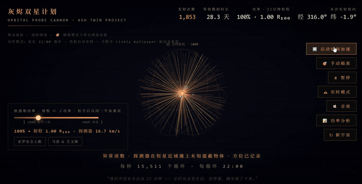

# Outer Wilds ATP

<b>English</b> | <a href="README.zh-CN.md">简体中文</a>

# ⚠️ S P O I L E R   W A R N I N G ⚠️

# This page contains major spoilers for Outer Wilds and its DLC

### Haven't finished the game? Close this page. Now.

**The existence of this project is itself a spoiler.**

Every line below takes away a moment you were meant to find on your own.
Those moments happen once. There is no save file that gives them back.

**Go play it. Come back when you're done. We'll be here.**

 

---

<b>✅ I've finished the base game and Echoes of the Eye — show everything</b>

 

  

Brute-force search under time acceleration · recorded at 3× speed

> Orbital Probe Cannon · Ash Twin Project Simulator
> A fan-made *Outer Wilds* simulator.

Single file, zero dependencies, pure WebGL. Open it and it runs. Leave it running as a live wallpaper.

## What this is

In canon, the Nomai's Orbital Probe Cannon fired **9,318,054 times** before it hit the
Eye of the Universe. This simulator turns that into something you can actually watch:
random directions, finite range, shot after shot, until one of them lands on those
coordinates — and then it hands you a set of Nomai warp coordinates.

Every "new universe" re-randomizes where the Eye is, so your luck won't be the Nomai's.

## What's modeled

- **Physics** — range ∝ √power. The Eye's distance follows a truncated log-normal prior:
  inner bound from generational telescope surveys plus the absence of signal parallax,
  outer bound from the star's gravitational binding limit
- **Canon calibration** — the expected loop count is back-derived from the 9,318,054 figure.
  The canon universe sits at d ≈ 1.35 R₁₀₀, which requires ≥183% power — which is exactly
  why Mallow and Avens had to overload the cannon
- **The power argument** — the two ends of the slider are Yarrow's safety limit and Mallow & Avens
- **The Quantum Moon** — relocates among six positions while unobserved; the observation
  check accounts for occlusion by the sun, the five planets, the Interloper, and the
  Stranger's cloak
- **Unintended discovery** — probes run into the Stranger on their way out. Optical
  camouflage stops telescopes, not kinetic impacts. The summary reports which shot first found it
- **A dying universe** — distant stars go supernova one by one as the loops pile up
- **Warp coordinates** — the summary yields three Nomai glyphs: longitude, latitude, distance.
  Six points, one unbroken stroke, 975 glyphs each, ~927 million combinations, resolving to
  0.37° / 0.18° / 44 km

## How to use

Open `index.html` in any browser with WebGL support.

| Control | What it does |
|---|---|
| Drag / scroll | Rotate and zoom the view |
| ⏩ Time acceleration | Automatic brute force — millions of shots in seconds |
| 🎯 Manual aim | Click the range sphere to fire one yourself |
| 🕰 Real-time mode | Advances at one real 22-minute loop per loop; idles and autosaves |
| 📊 Power analysis | Relationship between power and hit probability |
| ↻ New universe | Re-randomize the Eye's position |

**As a live wallpaper:** in real-time mode the entire UI fades out when idle. Pair it with
something like Lively Wallpaper and leave it running; progress survives a reboot.

**Optional BGM:** drop your own `bgm.mp3` next to `index.html` and it loops (the official
soundtrack, for instance). No audio ships with this repository for copyright reasons; without
that file the simulator falls back to a synthesized drone.

## Implementation notes

- A single `index.html`, ~2400 lines, with no external dependencies and no network requests
- WebGL renders the starfield, orbital reference rings, the planetary system, and a
  trajectory cloud of millions of shots
- Reproducible RNG (mulberry32); every shot consumes exactly 3 random numbers, so the
  endgame can replay the entire history of trajectories
- Millions of shots can't be stored individually — when the trajectory buffer fills, it
  drops every other sample and doubles the stride, staying a uniform sample of all history

---

*"We didn't lose those 22 minutes — they never happened. But the answer stayed."*

---

## Disclaimer

Unofficial fan work. Not affiliated with Mobius Digital or Annapurna Interactive.
*Outer Wilds*, and the names and lore within it, belong to their respective copyright holders.
The code in this repository is released under the MIT License — see [LICENSE](LICENSE).
